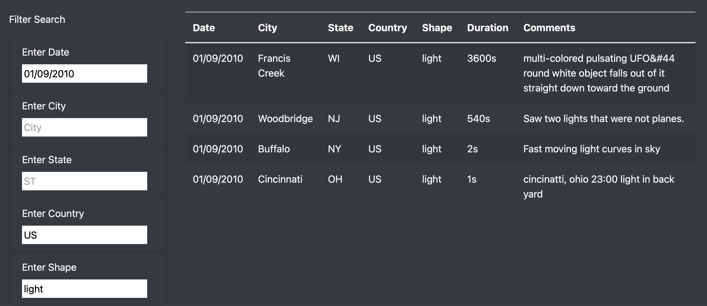
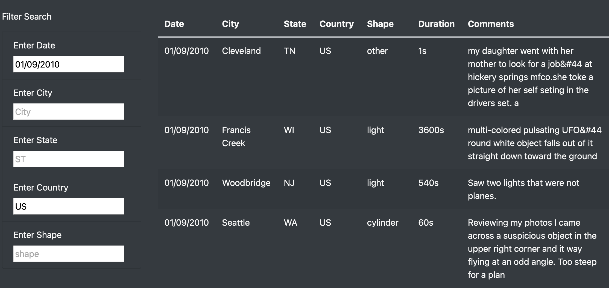
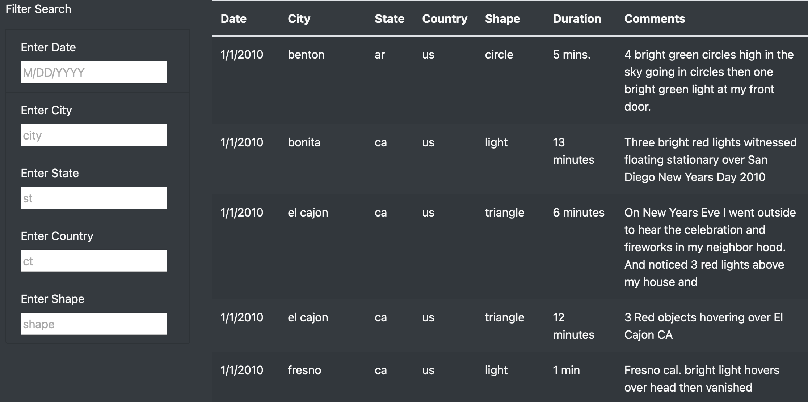
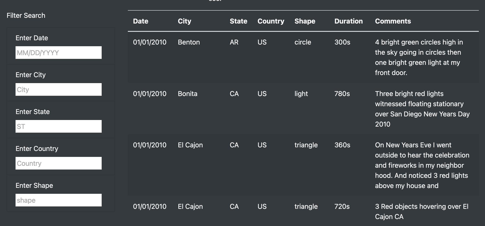
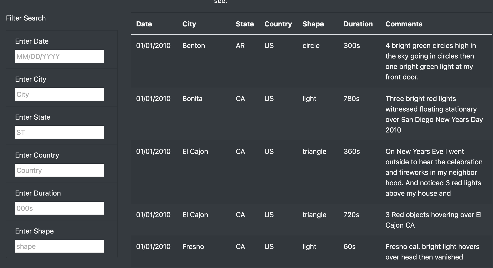

# UFOs

### Project Purpose 
  This project aims to create a webpage featuring a dynamic table to provide an in-depth analysis of UFO sightings by allowing users to filter for multiple criteria at the same time. 

### Results
  This webpage features a very simple and user friendly interface to specify the given search criteria. Five filters are in place. By default the table is populated with our initial set of data and it updates without the use of a button. Available search fields currently on webpage: 
  - date
  - city
  - state
  - country
  - shape
  
The process is the following : 

### Narrowing Down the Search: 
**Step 1**: Enter value in desired field. \
**Step 2**: Hit return OR move to the next field. Both actions display the updated filtered table. \
**Step 3**: Enter value in next field and repeat the process in Step 2. 

*Our table filtered for light shaped sightings in the US for 01/09/2010*

As we input each value into the search fields our search immediately narrows down as the table is automatically updated so we will end up using only the fields we need. This is a far more intuitive process than having to enter all fields and then hit an "update" button. 

### Broadening the Search: 
**Step 1**: Backspace on the field you want to remove until you reach the placeholder value. \
**Step 2**: Hit Return, click on any point of the page's body, or move to the next field. 

*the new table after we've removed the "shape" filter displays all sightings in the US for 01/09/2010*

## Summary 

#### Drawbacks / Date, City and State Format

We have created a web page where our data table updates automatically without the need of a button. We are now able to get insight on specific events by filtering dates, cities, states, countries and shapes . Although our page works fine with our current dataset, looking into the future we notice a few drawbacks. 
Due to our data file's initial structure we faced a serious drawback that could affect the functionality of the page. The date format was not correctly specified. Our filter initially accepted the following date format : M/DD/YYYY. That works fine for the data we have now as all sightings happened in January. If we later have a sighting in October and we perform a search based on the date filter we will get an empty table. To resolve this we would have to alter the value for the Date key to the following format : MM/DD/YYYY

  In the same way State and City names are in lower case letters which might confuse a user expecting uppercase letter for state values and capitalized city names as is the common practice. If for example one enters CA for California will get no results.

*Here is our initial data displayed on the table :*

This could be resolved by defining "example" placeholders like "st" for State or "city" for City. In this example we are using M/DD/YYYY to indicate the code expects one digit for month, two for day and four for year. In the city field we use lower case placeholder "city"  and for the state we use "st" to indicate we expect the input in small letters for both fields. This might work but what the best practice would be to edit our data.js file by capitalizing the city name, using all caps for the state and use the MM/DD/YYYY format for dates. (*note: Once we modify the date for a single sighting then the field automatically starts accepting the new format)

*Here is what the corrected data looks like now :*

### Further Development / Duration

  One useful development for our webpage would be to include a duration filter so that the user can specify if they are looking for brief events or longer events. A sudden short lived light shape does not carry the same weight as an object that hovers over a city for 30 minutes. This brings us to another big data problem. When we examine our initial data we see that duration entries are made using different formats, sometimes different units (weeks, days, minutes, seconds) and also qualitative entries such as, unknown, do not remember, all night long etc. 
  
  To be able to use a duration filter we need everything converted in a single unit and with the same extension *(sec or s)* .To modify the entries to the smallest unit which in this case is seconds. In entries that include "between x and y hours" I used the average duration (E.g. 1-2 hours = 1,5 hours = 5400s). For entries including "unknown" I used the value of 1 second. For durations that include "all night long" or "from dusk till dawn" I calculated 6 hours which translates to 3600s. Our suggested placeholder would probably be "000s". Here is what the table looks like with the new filter and modified Duration entries. 

