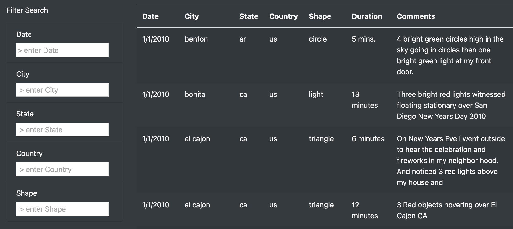

# UFOs

### Project Purpose 
  This project aims to create a webpage featuring a dynamic table to provide an in-depth analysis of UFO sightings by allowing users to filter for multiple criteria at the same time. 

### Results
  This webpage features a very simple and user friendly interface to specify the given search criteria. Five filters are in place. By default the table is populated with our initial set of data. The process is as follows : 

### _narrowing down the search: 
**Step 1**: Enter value in desired field. \
**Step 2**: Hit return OR move to the next field. Both actions display the updated filtered table. \
**Step 3**: Enter value in next field and repeat the process in Step 2. 

*Our table filtered for light shaped sightings in the US for 01/09/2010*

### _broadening the search: 
**Step 1**: Backspace on the field you want to remove until you reach the placeholder value. \
**Step 2**: Hit Return, click on any point of the page's body, or move to the next field. 

*the new table after we've removed the "shape" filter displays all sightings in the US for 01/09/2010*

### Summary 

  We have created a web page where our data table updates automatically without the need of a button. We are now able to get insight on specific events by filtering dates, cities, states, countries and shapes . Although our page works fine with our current dataset, looking into the future we notice a few drawbacks. 
Due to our data file's initial structure we faced a serious drawback that could affect the functionality of the page. The date format was not correctly specified. Our filter initially accepted the following date format : M/DD/YYYY. That works fine for the data we have now as all sightings happened in January. If we later have a sighting in October and we perform a search based on the date filter we will get an empty table. To resolve this we would have to alter the value for the Date key to the following format : MM/DD/YYYY

  In the same way State and City names are in lower case letters which might confuse a user expecting uppercase letter for state values and capitalized city names as is the common practice. If for example one enters CA for California will get no results.

*Here is our initial data displayed on the table :*

This could be resolved by defining "example" placeholders like "st" for State or "city" for City but correcting our data.js file is surely a more efficient process.

*Here is what the corrected data looks like now :*

  In terms of readability, the duration format has to be in the same unit. In our initial data we had entries in minutes, mins., min, seconds,sec and also qualitative entries such as, unknown, do not remember, all night long etc. If we later decide to include a duration filter we would need the duration data measured with the same unit. Therefore a prudent move would be to modify the entries to the smallest unit which in this case is seconds. In entries that include "between x and y hours" I used the average duration (E.g. 1-2 hours = 1,5 hours = 5400s). For entries including "unknown" I used the value of 1 second. For durations that include "all night long" or "from dusk till dawn" I calculated 6 hours which translates to 3600s. 

